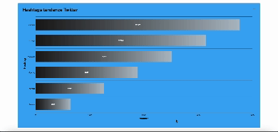

<h1 align="center">
  <b><center>Analyse en temps réel des hashtags sur twitter<br></b></center>
</h1>


---

La structure générale de notre projet :
Commence par la première phase, à savoir la "data ingestion". Nous collecterons les tweets via l'API Twitter dans notre application cliente, les enregistrant au format JSON. La version la plus récente de l'API Twitter, la version 2, constitue l'interface de programmation d'application actuelle proposée par Twitter aux développeurs pour accéder aux données et aux fonctionnalités de la plateforme. Elle est conçue de manière modulaire, permettant aux développeurs de choisir les endpoints spécifiques nécessaires plutôt que d'accéder à l'ensemble des données de Twitter. Cependant, l'endpoint requis n'est malheureusement pas accessible gratuitement, car l'offre gratuite ne permet que la récupération des données de l'utilisateur lui-même. Par conséquent, nous avons opté pour une alternative en utilisant WireMock, offrant une API simulant le comportement de l'API Twitter à l'adresse https://api.twitter.com/2/tweets/search/recent.

Par la suite, les tweets récupérés seront transmis à Spark via une connexion TCP. Spark effectuera un traitement initial des données en streaming pour extraire les hashtags, avant d'afficher les résultats dans un tableau de bord visuel alimenté par ApexCharts

--- 
​
### Exécution de l'application
- La version Java doit être compatible avec pyspark. La version actuelle de pyspark est la 3.2.0 et seule la version Java 11 est
   compatible. Vous pouvez vérifier la version de Java en exécutant la commande ```java --version```. Assurez-vous de n'avoir que Java compatible version installée, et d'avoir python3.7
- ```cd Spark-tweet```
- ```pip install -r ./requirements.txt```

#### 1. Exécution automatique

Exécuter ```python run.py```


### Représentation visuelle
http://localhost:5001/ 
ou
http://127.0.0.1/5001

### Arrêter l'application
exécutez ```sh kill.sh``` dans un nouveau terminal


### Demo



